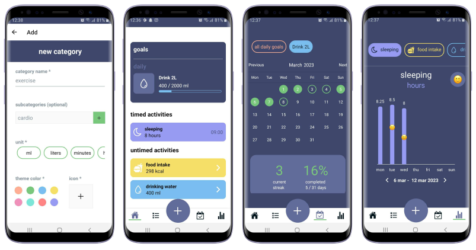

# track-it

A tracker app designed to build habits and gain insights into your daily behaviour and mood

## features

With the track-it app you can:
* create any custom behavioural category you would like to track
* set daily and weekly goals
* log your mood and activities throughout the day
* review your goal completion rate and current streak
* review your activity level per category (or subcategory) throughout the week or month
* review how your daily mood correlates with this activity level



## technologies

Track-it is a React Native application built with Expo and a Firebase backend.
The firebase database is set up in a way that each user has their own subcollection of activities, (behavioural) categories, goals and moods.
Goals and activities are linked to a category. Which means that whenever a user updates, for example the icon of a category, it does not need to be changed for every goal and activities but will instead get pulled from the category.
Whenever the user deletes a category, all related goals and activities are deleted as well.

To increase the speed of the app, manuel retrieval of the data from the database is performed after every time a user adds, edits or deletes an item.
This was preferred over a snapshot that automatically listens to any changes within the database, as this caused an abundance of state re-renders.

  

## getting started

1. Clone the repository and install the dependencies
```
git clone https://github.com/msleeuwenhoek/track-it.git
cd track-it
npm install
```

2. Create a [new firebase project](https://console.firebase.google.com/)

3. Enable authentication with email/password on your firebase project

4. Update the firebase config file
  - Get your configuration data from [your project](https://console.firebase.google.com/project/_/settings/general/).
  - Then update the [firebase config file](./config/firebase.js) in your repository.

```
apiKey: "YOUR API_KEY",
authDomain: "YOUR AUTH_DOMAIN",
projectId: "YOUR PROJECT_ID",
storageBucket: "YOUR STORAGE_BUCKET",
messagingSenderId: "YOUR MESSAGING_SENDER_ID",
appId: "YOUR APP_ID",
measurementId: "YOUR MEASUREMENT_ID",
```

